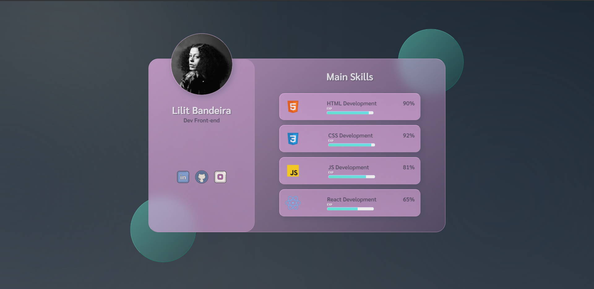

#  Card em Glassmorphism

- Exercitando flex-container, glassmorphism, transition, animation;

- Projeto realizado a partir deste [vídeo](https://www.youtube.com/watch?v=O7WbVj5apxU&list=TLPQMTkwMTIwMjGXeh18I7i1aA&index=2);

- Vi recentemente alguns projetos no LinkedIn utilizando essa animação via VanillaJS, que é basicamente JavaScrirpt puro, e decidi adicionar no meu projeto também, confesso que eu não curto muito esse efeito, mas foi legal ver funcionando; 

  

